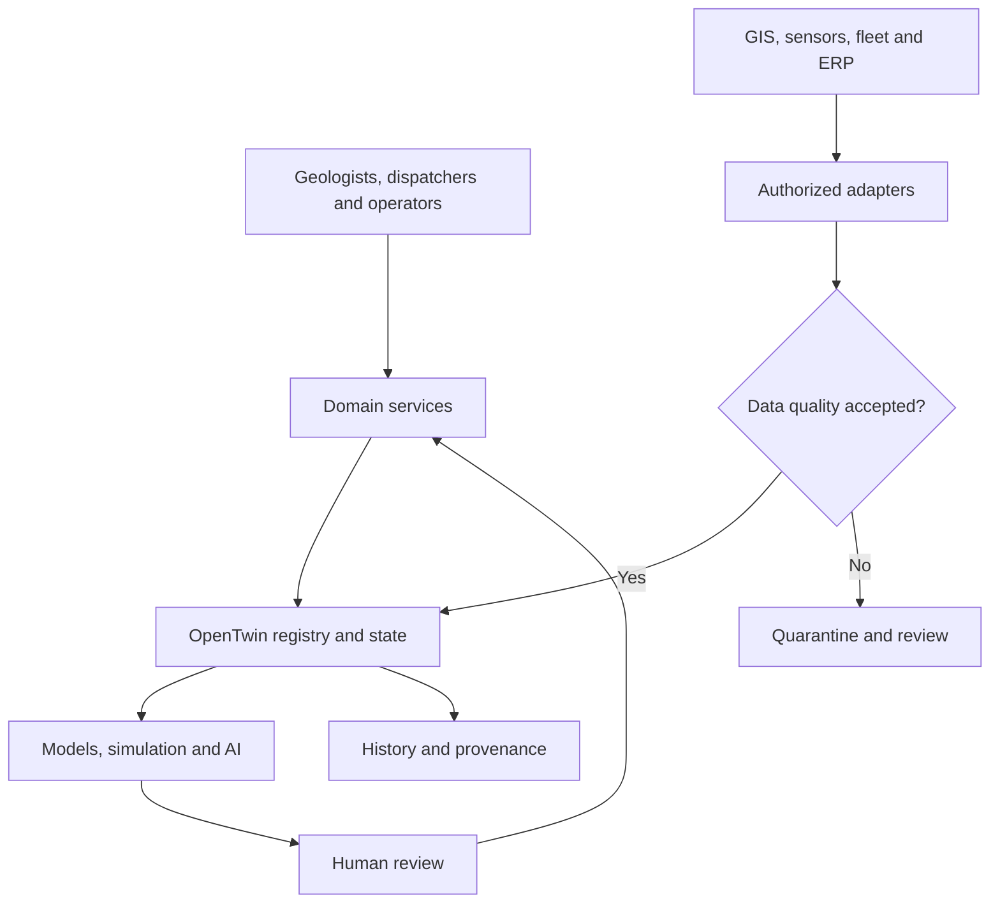
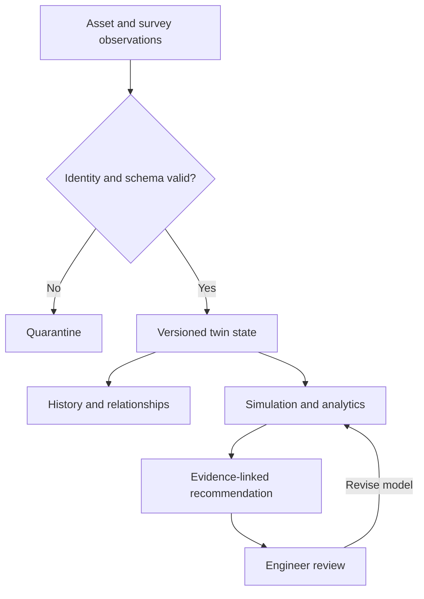
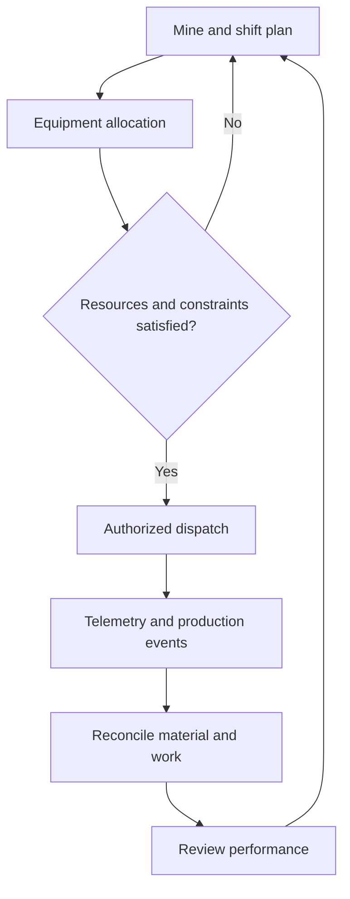
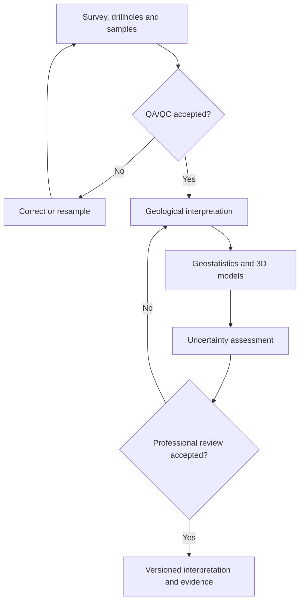
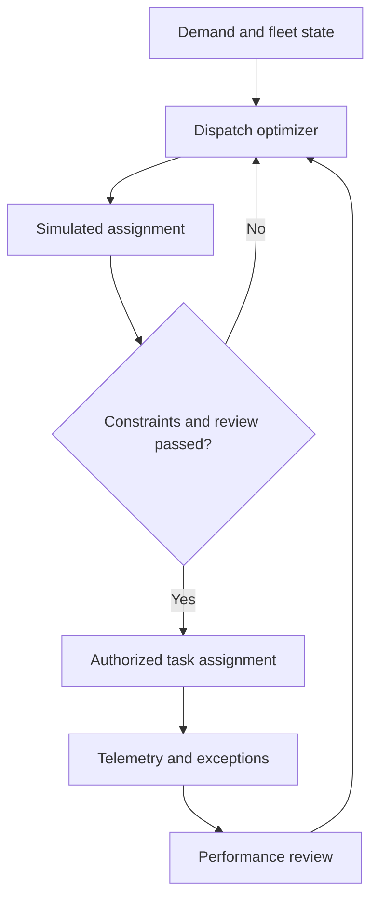
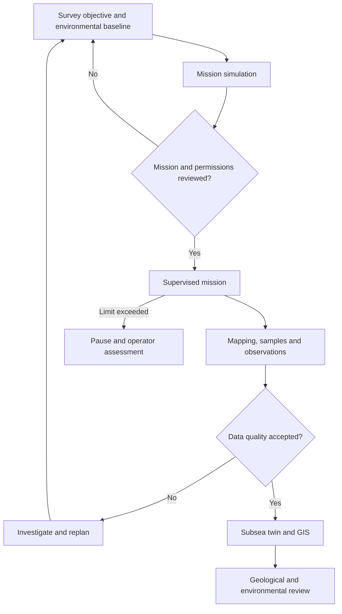
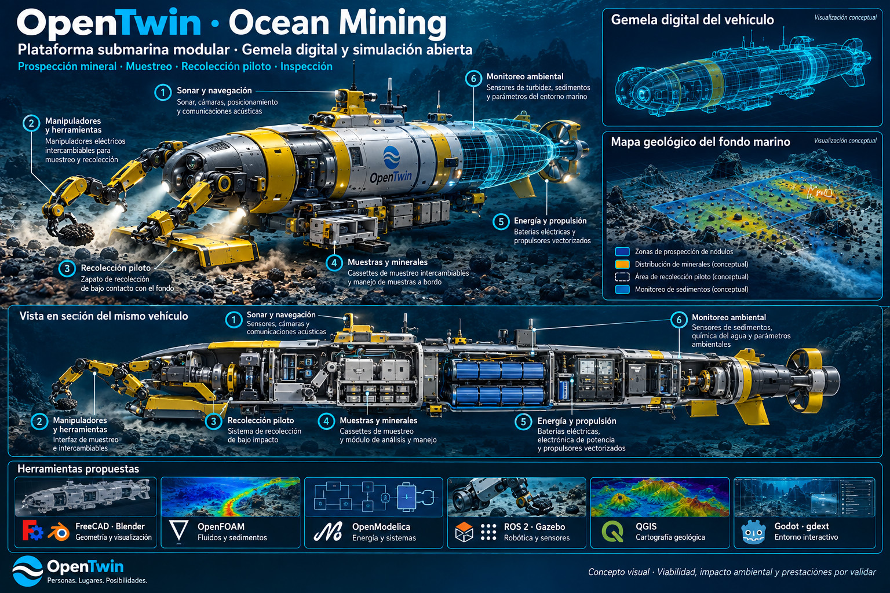
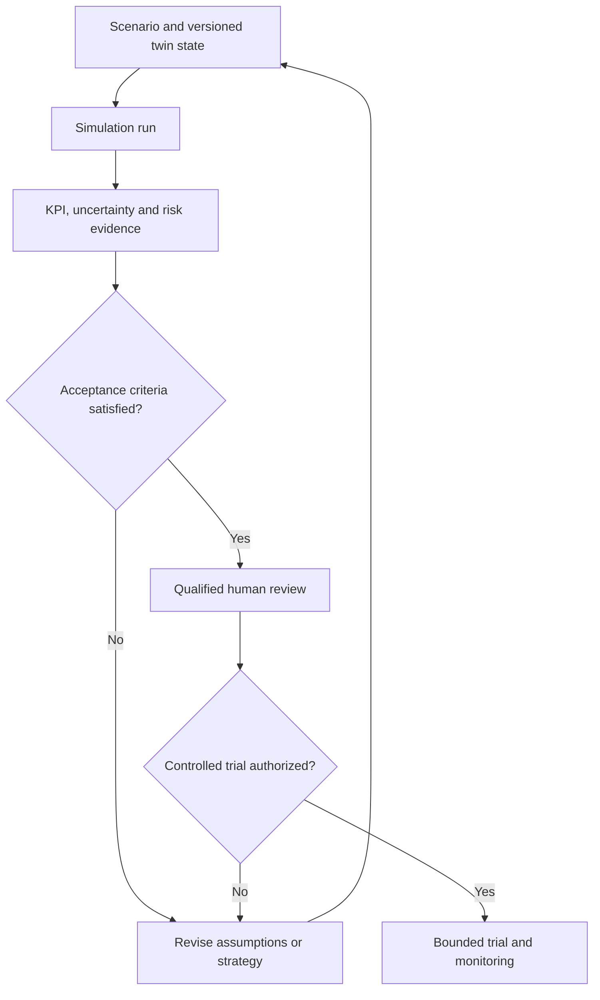
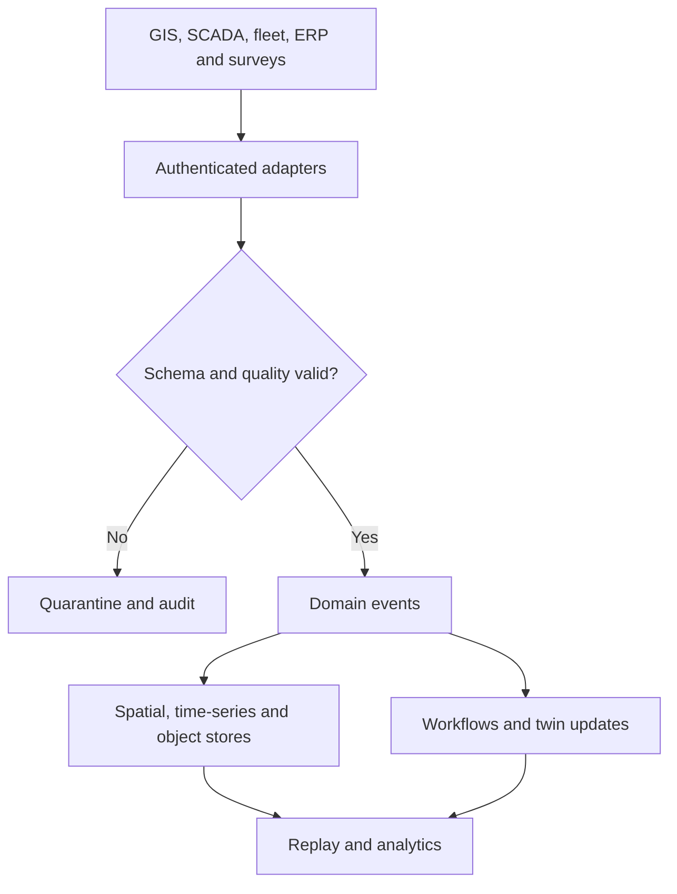
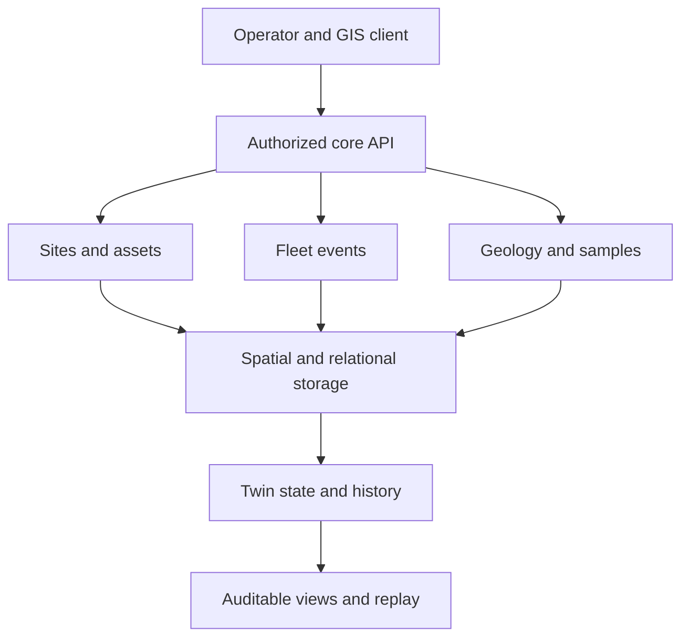

# jfxai4moms --- OpenTwin AI-Powered Mining Operations Management & Geological Modeling Platform

> Open, modular reference architecture for AI-assisted mining
> operations, geological modeling, mineral exploration, mine planning,
> fleet optimization, geostatistics, simulation, GIS, deep-sea
> exploration, and operational digital twins.

**Status:** Reference architecture and design-concept catalog. The repository contains documentation, CAD illustrations and Drawio diagrams; it does not yet provide a unified executable mining platform.

## Table of Contents

-   [Description and Context](#description-and-context)
-   [Vision](#vision)
-   [Objectives](#objectives)
-   [Reference Architecture](#reference-architecture)
-   [OpenTwin Mining Model](#opentwin-mining-model)
-   [Mining Operations Management](#mining-operations-management)
-   [Geological Modeling and Mineral
    Exploration](#geological-modeling-and-mineral-exploration)
-   [Fleet Dispatch and Autonomous
    Operations](#fleet-dispatch-and-autonomous-operations)
-   [Deep-Sea and Subsea Exploration](#deep-sea-and-subsea-exploration)
-   [CAD Design Concepts](#cad-design-concepts)
-   [GIS and Spatial Intelligence](#gis-and-spatial-intelligence)
-   [AI ML and Optimization](#ai-ml-and-optimization)
-   [Simulation and Digital
    Engineering](#simulation-and-digital-engineering)
-   [Data and Event Architecture](#data-and-event-architecture)
-   [Security Safety and
    Sustainability](#security-safety-and-sustainability)
-   [MBSE CAD CAM CAS](#mbse-cad-cam-cas)
-   [Open-Source Technology
    Compendium](#open-source-technology-compendium)
-   [User Guide](#user-guide)
-   [Installation Guide](#installation-guide)
-   [Dependencies](#dependencies)
-   [Recommended Repository
    Structure](#recommended-repository-structure)
-   [MVP](#mvp)
-   [Development Roadmap](#development-roadmap)
-   [How to Contribute](#how-to-contribute)
-   [Code of Conduct](#code-of-conduct)
-   [Authors and Maintainers](#authors-and-maintainers)
-   [Additional Information](#additional-information)
-   [Intellectual Property and Open
    Design](#intellectual-property-and-open-design)
-   [Disclaimer](#disclaimer)
-   [License](#license)

------------------------------------------------------------------------

## Description and Context

**jfxai4moms / OpenTwin AI-Powered Mining Operations Management &
Geological Modeling Platform** consolidates an open-source technology
compendium for mining operations management, geological modeling,
mineral exploration, fleet dispatch, geostatistics, GIS, artificial
intelligence, autonomous systems, deep-sea exploration, simulation, and
digital twins.

The source repository describes an **AI-Powered Mining Operations
Management Platform** and references technologies and research areas
including MinERP, OpenMines, ERPNext Cargo Management, AuMMS, Triton
Mining, multi-agent reinforcement learning, ROS2-TMS, mineral
prospectivity mapping, SmartMine, Mining-Gym, Open Construction
Simulator, MineSim-Dynamic, drillhole database management, Mapbox GL JS,
OpenJUMP, geostatistics and machine learning, reservoir simulation,
Albion/QGIS geological modeling, Blender geological modeling tools,
FreeCAD Trails, mineral-resource estimation, and drill-hole
visualization.

This document reorganizes those references as **required dependencies,
optional integrations, and research references** instead of treating the
entire compendium as a mandatory runtime stack.

The repository also defines an engineering lifecycle organized around:

**MBSE** defines needs, architecture and interfaces; **CAD** captures geometry; **CAM** addresses manufacturing where applicable; **CAS** evaluates modeled behavior.

with Arcadia/Capella as a systems-engineering reference.

------------------------------------------------------------------------

## Vision

Connect geological interpretation, operational planning and robotic research through an auditable OpenTwin core. Shared identifiers and provenance link terrestrial mining, port logistics and subsea exploration; simulation and AI produce evidence for qualified human decisions.

------------------------------------------------------------------------

## Objectives

-   Provide a modular reference architecture for mining operations
    management.
-   Integrate geological, operational, logistics, maintenance, and
    spatial information.
-   Support 2D/3D geological modeling and mineral exploration workflows.
-   Represent mines, deposits, drillholes, vehicles, equipment,
    infrastructure, and subsea assets as digital twins.
-   Support mine fleet dispatch and optimization.
-   Enable simulation before deployment of operational policies.
-   Integrate GIS and geostatistical workflows.
-   Support AI-assisted mineral prospectivity and resource-analysis
    research.
-   Support autonomous and robotic operations through replaceable
    interfaces.
-   Extend the architecture to subsea and deep-sea mineral exploration.
-   Preserve traceability from requirements and MBSE through simulation.
-   Minimize proprietary lock-in through open interfaces and replaceable
    components.

------------------------------------------------------------------------

## Reference Architecture



Cross-cutting concerns:

**Safety · Security · Environmental Monitoring · Provenance ·
Observability · Interoperability · Open Licensing · Resilience**

------------------------------------------------------------------------

## OpenTwin Mining Model

Candidate digital twins include:

-   Mine Twin
-   Geological Deposit Twin
-   Drillhole Twin
-   Block Model Twin
-   Pit Twin
-   Underground Working Twin
-   Haul Road Twin
-   Truck Twin
-   Excavator Twin
-   Drill Rig Twin
-   Processing Plant Twin
-   Conveyor Twin
-   Stockpile Twin
-   Port/Terminal Twin
-   Subsea Asset Twin
-   AUV/ROV Twin
-   Environmental Monitoring Twin



Example:

``` yaml
twin:
  id: haul-truck-001
  type: mining-haul-truck
  state:
    operational_status: available
    location: {}
    payload_tonnes: 0
    fuel_or_energy: {}
    health: {}
  telemetry_refs: []
  work_order_refs: []
  relationships: []
  provenance: {}
```

------------------------------------------------------------------------

## Mining Operations Management

Potential capabilities:

-   production planning;
-   shift management;
-   dispatch;
-   haulage;
-   drilling;
-   loading;
-   stockpile management;
-   material tracking;
-   maintenance;
-   fuel/energy monitoring;
-   warehouse/inventory;
-   cargo and freight;
-   production KPIs;
-   operational reporting.



------------------------------------------------------------------------

## Geological Modeling and Mineral Exploration



Potential functions:

-   drillhole databases;
-   assay/sample management;
-   lithology;
-   stratigraphy;
-   structural geology;
-   3D geological modeling;
-   interpolation;
-   variography;
-   resource estimation;
-   mineral prospectivity mapping;
-   uncertainty analysis;
-   spatial simulation.

Generated resource estimates or geological interpretations require
professional validation before operational or investment use.

------------------------------------------------------------------------

## Fleet Dispatch and Autonomous Operations

The source compendium includes simulation and reinforcement-learning
references for dispatch and robot planning.



Candidate capabilities:

-   truck dispatch;
-   route optimization;
-   queue management;
-   equipment allocation;
-   dynamic obstacle handling;
-   autonomous vehicle research;
-   multi-agent planning;
-   predictive maintenance;
-   energy optimization.

AI/RL policies should first be evaluated in simulation and controlled
test environments before safety-critical deployment.

------------------------------------------------------------------------

## Deep-Sea and Subsea Exploration

The architecture can extend mining digital twins to marine exploration.



Candidate use cases:

-   seabed mapping;
-   geological survey;
-   environmental monitoring;
-   subsea infrastructure inspection;
-   autonomous mission planning;
-   bathymetry;
-   sample-location management;
-   digital-twin visualization.

The marine extension is a reference architecture and does not imply that
all depicted physical systems are implemented by the repository.

------------------------------------------------------------------------

## CAD Design Concepts

The [CAD directory](MBSE/CAD/) contains three illustrations linking ocean-mining research with offshore support and maintenance infrastructure. These are concept images, not editable CAD assemblies, working digital twins or approved equipment. Dashboard numbers and environmental claims in the artwork are illustrative.

| Concept | Asset | Proposed role |
| --- | --- | --- |
| Floating dry dock | [Design illustration](MBSE/CAD/floating-dry-dock-concept.jpg) | Vessel maintenance, equipment support and repair logistics |
| Self-elevating offshore platform | [Design illustration](MBSE/CAD/offshore-platform-concept.jpg) | Site-specific shallow-water research, handling and infrastructure support |
| OpenTwin Ocean Mining | [Vehicle cutaway](MBSE/CAD/opentwin-ocean-mining-digital-twin-cutaway-concept.jpg) | Mineral prospecting, sampling, pilot collection and environmental observation |

### Floating Dry Dock


The concept combines a modular dock deck, side structures, cranes, keel blocks and supports, ballast systems, utilities and an operations station. Its proposed twin would represent dock configuration, supported vessel geometry, ballast state, maintenance tasks, lifting resources and environmental observations.

For JFXAI4MOMS, the dock is a support asset for vessel repair and mining-equipment maintenance. Candidate simulations include resource scheduling, load distribution, ballast changes, maintenance downtime and waste/spill handling. The illustration's deck load, draft, ballast percentage and “Operational” status are not measured or approved limits. Structural capacity, stability, vessel compatibility and operating procedures require independent engineering evidence.

### Self-Elevating Offshore Platform


The platform depicts a modular deck supported by jack-up legs, handling cranes, a helideck, accommodation, utilities and subsea access. Its twin would track leg/deck configuration, equipment readiness, crane tasks, utility demand and local environmental conditions.

The proposed role is site-specific coastal or shallow-water survey, maintenance and infrastructure support. This is **not a deep-ocean seabed support foundation**: water depth, seabed bearing conditions, leg loads, weather and installation method must be established for a particular site. The ocean-mining vehicle may operate in a separate location; the illustration does not establish that the jack-up platform can support an abyssal mission.

Hydrodynamic, structural, geotechnical and handling studies remain necessary. Standards and classification names printed in the image are references, not evidence of conformity or certification.

### OpenTwin Ocean Mining



The consolidated vehicle concept combines robotic intervention with a modular research hull. Its primary focus is mineral prospecting, sample acquisition and controlled pilot collection. The baseline is an **uncrewed battery-electric platform** with supervised mission operation; autonomous behavior and operating depth are not validated.

| Module | Depicted function | Proposed twin records |
| --- | --- | --- |
| Sonar and navigation | Mapping, cameras, positioning and acoustic communications | Sensor calibration, reference frame, position uncertainty and communication state |
| Manipulators and tools | Interchangeable sampling and handling equipment | Tool identity, joint state, task progress and load assumptions |
| Pilot collector | Experimental mineral collection at the seabed | Collection footprint, scenario settings and sediment observations |
| Sample cassettes | Mineral storage and sample handling | Sample ID, location, timestamp, custody history and assay references |
| Energy and propulsion | Batteries, power electronics and electric thrusters | Energy state, demand, thermal assumptions and component health |
| Environmental monitoring | Turbidity, sediment and water-condition sensing | Baseline observations, quality flags, thresholds and reviewer decisions |

The cutaway and geological map are visual concepts. “Low impact” is an objective to test, not an established outcome. The repository does not demonstrate commercial extraction capacity, mineral reserves, certified pressure integrity or an approved environmental footprint.

The proposed workflow connects survey observations to geological interpretation, traceable samples and separately reviewed pilot-collection scenarios. A field operation requires its own permissions, environmental assessment and qualified operational review; successful simulation alone is not authorization.

### Shared Simulation and Integration Plan

Tool roles shown in the images are proposed integrations. Existing project licensing, dependency and provenance rules apply to each selected version.

| Workstream | Candidate tools | Expected evidence |
| --- | --- | --- |
| Geometry and visualization | FreeCAD, Blender | Versioned geometry, consistent cutaway views and component identifiers |
| Fluids and sediment studies | OpenFOAM | Scenario-specific meshes, boundary conditions and validated transport assumptions |
| Energy and systems | OpenModelica | Battery, propulsion and utility models with explicit parameter sources |
| Robotics and sensors | ROS 2, Gazebo | Simulated sensor streams, tool interactions and repeatable mission replay |
| Geological mapping | QGIS-compatible workflows | Coordinate-aware survey layers, sample positions and uncertainty |
| Interactive presentation | Godot via gdext | Operator views linked to model state rather than independent invented telemetry |
| Monitoring and integration | Existing SCADA, GIS and event adapters | Authorized data exchange, audit history and quality indicators |

Use common asset IDs, configuration versions, units, coordinate frames, timestamps and scenario identifiers. Distinguish measured telemetry, synthetic observations and AI estimates. Simulation adapters must define clock synchronization, ownership and degraded-communication behavior.

The three concepts share data contracts and logistics records; they do not constitute a demonstrated, physically integrated mining installation.

### CAD Verification Roadmap

1. Establish editable geometry and reconcile all views with one configuration baseline.
2. Define asset-specific load, energy, environmental and operating assumptions.
3. Create separate dock, jack-up-platform and vehicle models with named acceptance criteria.
4. Validate sample traceability, mission replay and environmental-event handling with synthetic datasets.
5. Compare physical-model results with suitable test data before making performance claims.
6. Review any real-world deployment independently from the software demonstration.


------------------------------------------------------------------------

## GIS and Spatial Intelligence

Potential spatial layers:

``` text
Geology
Drillholes
Resource Blocks
Mine Boundaries
Haul Roads
Equipment Positions
Infrastructure
Environmental Sensors
Hydrology
Topography
Bathymetry
Subsea Assets
```

GIS functions may include visualization, spatial analysis, editing, map
services, coordinate transformations, terrain models, geological layers,
and integration with 3D engineering environments.

------------------------------------------------------------------------

## AI ML and Optimization

Potential AI/ML functions include:

-   mineral prospectivity mapping;
-   geological classification;
-   resource-model research;
-   fleet dispatch;
-   multi-agent planning;
-   dynamic routing;
-   production forecasting;
-   anomaly detection;
-   predictive maintenance;
-   operational optimization;
-   environmental analytics.

Recommended AI provenance:

``` yaml
model_run:
  model_id:
  model_version:
  timestamp:
  input_dataset:
  input_provenance:
  parameters:
  output:
  uncertainty:
  validation_status:
  reviewer:
```

AI-generated recommendations should remain traceable to data, model
versions, assumptions, and validation results.

------------------------------------------------------------------------

## Simulation and Digital Engineering

Simulation can provide a safe environment for evaluating:

-   truck dispatch;
-   fleet scheduling;
-   production policies;
-   obstacle avoidance;
-   mine traffic;
-   processing flows;
-   logistics;
-   equipment availability;
-   autonomous agents;
-   emergency scenarios;
-   environmental impacts.



------------------------------------------------------------------------

## Data and Event Architecture



Example events:

``` text
drillhole.created
sample.assay.received
geological_model.updated
truck.dispatched
truck.loaded
truck.dumped
equipment.health.changed
maintenance.required
stockpile.quantity.changed
auv.mission.started
environmental.threshold.exceeded
```

------------------------------------------------------------------------

## Security Safety and Sustainability

Recommended controls:

-   identity federation;
-   RBAC/ABAC;
-   MFA for privileged users;
-   network segmentation between OT and IT;
-   encrypted communications;
-   secrets management;
-   signed software artifacts;
-   audit trails;
-   telemetry integrity;
-   backup and recovery;
-   offline/degraded-operation planning;
-   safety interlocks independent of AI;
-   vulnerability and dependency scanning;
-   controlled update procedures;
-   incident response.

Environmental architecture may support:

-   water-quality monitoring;
-   dust/noise monitoring;
-   emissions/energy metrics;
-   rehabilitation monitoring;
-   biodiversity observations;
-   marine environmental telemetry.

Digital twins and AI are decision-support mechanisms and must not bypass
independent physical safety controls.

------------------------------------------------------------------------

## MBSE CAD CAM CAS

The repository defines a development structure for:

**MBSE** defines needs, architecture and interfaces; **CAD** captures geometry; **CAM** addresses manufacturing where applicable; **CAS** evaluates modeled behavior.

### MBSE

Arcadia/Capella can model:

The intended traceability sequence is: **Stakeholder Needs → Operational Analysis → System Context → Capabilities → Architecture → Interfaces → Models → Simulation → Verification → Validation**. Each stage references versioned artifacts and can be revisited when evidence changes.

### CAD

Candidate engineering domains:

-   mine infrastructure;
-   haul roads;
-   processing facilities;
-   mechanical systems;
-   mobile equipment;
-   marine/subsea assets.

### CAM

Manufacturing and assembly artifacts can support prototype or
equipment-development work where applicable.

### CAS

Computer-aided simulation can evaluate end-to-end functionality and
performance before physical implementation.

------------------------------------------------------------------------

## Open-Source Technology Compendium

| Domain | Candidate / Reference | Potential Role |
| --- | --- | --- |
| Mining ERP | MinERP | Mining operations management reference |
| Mine Simulation | OpenMines | Truck dispatch simulation |
| Logistics ERP | ERPNext Cargo Management | Freight/logistics reference |
| Manufacturing | AuMMS | Manufacturing-management reference |
| Deep-Sea Exploration | Triton Mining | AUV/seabed exploration reference |
| Multi-Agent AI | QMIX/VDN/COMA/MADDPG/MATD3/FACMAC/MASoftQ implementations | Robot/fleet planning research |
| Robotics | ROS2-TMS | IoRT/robotics integration reference |
| Mineral Exploration | Mineral prospectivity mapping tools | Spatial ML research |
| Mining Simulation | SmartMine | AI-powered mining simulation reference |
| RL Benchmark | Mining-Gym | Truck-dispatch optimization |
| Construction Simulation | Open Construction Simulator | Construction/mining simulation reference |
| Mine Planning | MineSim-Dynamic | Dynamic obstacle/planning benchmark |
| Geology | Drillhole database tools | Exploration-data management |
| Web GIS | Mapbox GL JS | Interactive vector mapping; verify version-specific licensing |
| Desktop GIS | OpenJUMP | GIS analysis/editing |
| Geostatistics | C++ geostatistics/ML libraries | Modeling and simulation |
| Reservoir Modeling | ML reservoir simulation tools | Simulation research |
| Geological Modeling | Albion / QGIS | 3D geological modeling |
| Geological Modeling | Blender geological add-ons | 3D exploration visualization |
| Geomatics | FreeCAD Trails | Transportation/geomatics CAD |
| Resource Estimation | Open Python estimation/geostatistics tools | Mineral-resource analysis |
| Visualization | PyQt drillhole visualization tools | Exploration visualization |
| MBSE | Arcadia / Capella | Systems engineering |

Inclusion does not imply endorsement, bundling, mandatory dependency,
maintenance status, license compatibility, or production readiness. Each
candidate requires current technical, security, licensing, and
suitability review.

------------------------------------------------------------------------

## User Guide

Representative workflow:

1.  Register a mining project/site.
2.  Define users, roles, and operational areas.
3.  Import approved geological/GIS data.
4.  Register drillholes, infrastructure, and equipment.
5.  Create OpenTwin assets.
6.  Connect authorized fleet/telemetry adapters.
7.  Configure production and dispatch workflows.
8.  Run geological or operational simulations.
9.  Apply approved AI/optimization models.
10. Review uncertainty and provenance.
11. Validate recommendations through qualified personnel.
12. Track production, maintenance, safety, and environmental indicators.

------------------------------------------------------------------------

## Installation Guide

Clone the repository:

``` bash
git clone https://github.com/robotics-intelligent-systems/jfxai4moms.git
cd jfxai4moms
```

The repository should currently be treated primarily as a **technology
compendium and reference architecture** unless an individual module
provides executable installation instructions.

Do not assume every referenced project must be installed.

### Minimal Target Architecture

Start with a web/GIS client, an authorized mining API, site/asset/geology services, spatial storage and a versioned twin registry. The [MVP workflow](#mvp) shows their responsibilities.

### Extended Architecture

``` text
OpenTwin AI4MOMS
├── Spatial / Relational Database
├── Object Storage
├── Event Broker
├── Time-Series Storage
├── GIS Services
├── Geological Modeling Adapter
├── Fleet / Dispatch Adapter
├── ERP Adapter
├── ROS 2 / Robotics Adapter
├── SCADA / IoT Adapter
├── AI / Optimization Service
├── Simulation
├── Analytics
└── Audit / Provenance
```

Executable modules should document exact tested versions, environment
variables, build systems, package managers, storage, networking,
secrets, migrations, tests, and deployment procedures.

------------------------------------------------------------------------

## Dependencies

### Required Dependencies

Only dependencies required for a selected executable implementation
belong here.

### Optional Integrations

Potential examples:

-   Capella;
-   QGIS-compatible workflows;
-   OpenJUMP;
-   FreeCAD;
-   Blender;
-   ROS 2;
-   mine simulation frameworks;
-   geostatistics libraries;
-   PostgreSQL/PostGIS;
-   time-series databases;
-   event brokers;
-   object storage;
-   container runtimes.

### Research References

Models, datasets, simulators, algorithms, and projects used for
comparison or experimentation without becoming runtime dependencies.

Recommended record:

``` yaml
dependency:
  name:
  version:
  role:
  status: required | optional | reference
  license:
  source:
  tested_platforms:
  security_notes:
  data_requirements:
  interoperability_notes:
```

------------------------------------------------------------------------

## Recommended Repository Structure

This is a proposed target layout. Only paths present in the repository should be treated as implemented artifacts.

``` text
jfxai4moms/
├── README.md
├── LICENSE
├── CONTRIBUTING.md
├── CODE_OF_CONDUCT.md
├── docs/
│   ├── architecture/
│   ├── geology/
│   ├── mining/
│   ├── subsea/
│   ├── security/
│   └── sustainability/
├── MBSE/
│   ├── operational/
│   ├── system/
│   ├── logical/
│   ├── physical/
│   ├── CAD/
│   ├── CAM/
│   └── CAS/
├── core/
│   ├── sites/
│   ├── assets/
│   ├── production/
│   └── maintenance/
├── twins/
│   ├── registry/
│   ├── mine/
│   ├── geology/
│   ├── fleet/
│   └── subsea/
├── geology/
│   ├── drillholes/
│   ├── resources/
│   └── geostatistics/
├── gis/
├── fleet/
│   ├── dispatch/
│   ├── routing/
│   └── telemetry/
├── robotics/
├── subsea/
├── ai/
│   ├── prospectivity/
│   ├── optimization/
│   ├── forecasting/
│   └── governance/
├── simulation/
├── analytics/
├── integrations/
├── api/
├── events/
├── audit/
├── deployment/
├── tests/
└── examples/
```

------------------------------------------------------------------------

## MVP



### MVP Features

-   mining-site/project registry;
-   equipment/asset registry;
-   drillhole registry;
-   basic GIS layers;
-   fleet location/status;
-   production events;
-   maintenance state;
-   OpenTwin registry/state/history;
-   audit/provenance;
-   REST API;
-   operator dashboard;
-   reproducible containerized deployment.

### MVP Success Criteria

-   sites and assets can be registered;
-   drillhole/geospatial data can be represented;
-   equipment state can be updated;
-   fleet events are auditable;
-   twin history can be reconstructed;
-   access controls protect operational functions;
-   deployment is reproducible;
-   no proprietary cloud is mandatory.

------------------------------------------------------------------------

## Development Roadmap

### Phase 1 --- Architecture and Documentation

-   [x] BID-inspired documentation organization.
-   [x] Technology-compendium consolidation.
-   [x] OpenTwin mining architecture.
-   [x] Mining/subsea twin taxonomy.
-   [ ] Architecture Decision Records.
-   [ ] Formal domain schemas.

### Phase 2 --- Mining Core

-   [ ] Sites and operational areas.
-   [ ] Asset registry.
-   [ ] Production events.
-   [ ] Maintenance.
-   [ ] Identity/authorization.
-   [ ] Audit/provenance.

### Phase 3 --- Geological Modeling

-   [ ] Drillhole model.
-   [ ] Sample/assay data.
-   [ ] Geological layers.
-   [ ] 3D geological model adapters.
-   [ ] Geostatistics.
-   [ ] Resource-estimation workflows.

### Phase 4 --- Fleet and Logistics

-   [ ] Fleet registry.
-   [ ] Telemetry.
-   [ ] Dispatch.
-   [ ] Route planning.
-   [ ] Cargo/logistics adapters.
-   [ ] Maintenance optimization.

### Phase 5 --- Digital Twins

-   [ ] Twin registry.
-   [ ] Mine Twin.
-   [ ] Equipment Twins.
-   [ ] Geological Twin.
-   [ ] Fleet Twins.
-   [ ] State/history/relationships.

### Phase 6 --- AI and Optimization

-   [ ] Prospectivity models.
-   [ ] Dispatch optimization.
-   [ ] Multi-agent research.
-   [ ] Predictive maintenance.
-   [ ] Model provenance.
-   [ ] Human-review workflows.

### Phase 7 --- Subsea Exploration

-   [ ] AUV/ROV adapters.
-   [ ] Mission model.
-   [ ] Bathymetry/seabed GIS.
-   [ ] Subsea Twin.
-   [ ] Environmental telemetry.
-   [ ] Ocean Mining vehicle geometry and sample-custody schema.
-   [ ] Floating-dock and jack-up-platform support-asset models.

### Phase 8 --- MBSE and Simulation

-   [ ] Capella models.
-   [ ] Mine/fleet simulations.
-   [ ] Dynamic-obstacle scenarios.
-   [ ] Subsea mission simulation.
-   [ ] Performance verification.

### Phase 9 --- Production Hardening

-   [ ] Observability.
-   [ ] High availability.
-   [ ] Backup/disaster recovery.
-   [ ] Cybersecurity testing.
-   [ ] Performance/load testing.
-   [ ] OT/IT segmentation validation.
-   [ ] Deployment-specific safety assessment.

------------------------------------------------------------------------

## How to Contribute

Contributions are welcome in:

-   mining software;
-   geological modeling;
-   mineral exploration;
-   GIS;
-   geostatistics;
-   mine simulation;
-   fleet optimization;
-   autonomous systems;
-   robotics;
-   deep-sea exploration;
-   digital twins;
-   AI/ML;
-   MBSE;
-   cybersecurity;
-   sustainability;
-   documentation.

Typical workflow:

``` bash
git checkout -b feature/my-contribution
git add .
git commit -m "Add: description of contribution"
git push origin feature/my-contribution
```

Pull requests should document:

-   problem and scope;
-   proposed solution;
-   architecture impact;
-   interfaces;
-   dependencies/licenses;
-   safety implications;
-   security implications;
-   environmental implications;
-   model/data provenance where relevant;
-   tests;
-   documentation.

Do not commit credentials, proprietary geological datasets, confidential
resource estimates, restricted operational data, or third-party material
without appropriate rights.

------------------------------------------------------------------------

## Code of Conduct

Contributors should maintain a respectful, inclusive, professional, and
technically constructive environment.

A dedicated `CODE_OF_CONDUCT.md` should be maintained at repository
root.

------------------------------------------------------------------------

## Authors and Maintainers

Maintained by the **Robotics Intelligent Systems** open-source
initiative.

Repository: `robotics-intelligent-systems/jfxai4moms`

Third-party projects, standards, datasets, models, trademarks, and
documentation remain the property of their respective owners.

------------------------------------------------------------------------

## Additional Information

The project can serve as:

-   an open mining-technology compendium;
-   a geological-modeling architecture reference;
-   an OpenTwin research platform for mining assets;
-   a simulation environment integration architecture;
-   an AI-assisted operations research foundation;
-   an MBSE reference for mine and subsea systems;
-   a framework for integrating independently developed open
    technologies.

------------------------------------------------------------------------

## Intellectual Property and Open Design

OpenTwin AI4MOMS favors:

-   open standards;
-   documented interfaces;
-   modular adapters;
-   replaceable implementations;
-   explicit provenance;
-   reproducible engineering artifacts;
-   appropriately licensed dependencies;
-   implementation independence where feasible.

The objective is to minimize proprietary lock-in and enable
independently developed compatible modules.

Open-source licensing does **not** by itself guarantee freedom from
third-party patents, trademarks, copyrights, dataset rights,
industrial-design rights, or other intellectual-property claims.
Implementers remain responsible for appropriate review.

------------------------------------------------------------------------

## Disclaimer

**jfxai4moms / OpenTwin AI-Powered Mining Operations Management &
Geological Modeling Platform is a research, educational, and engineering
project.**

It is not, by itself, a certified mine-control, autonomous-vehicle,
geological resource-reporting, industrial-safety, or maritime-control
system.

AI predictions, geological models, resource estimates, simulations, and
digital-twin outputs can be incomplete or inaccurate. Safety-critical,
investment, resource-reporting, environmental, and operational decisions
require appropriately qualified human review and applicable validation.

The BID repository template is used solely as a
**documentation-structure reference**. jfxai4moms does not claim BID/IDB
funding, sponsorship, endorsement, catalog membership, or institutional
affiliation.

------------------------------------------------------------------------

## License

The actual jfxai4moms project license should remain in the repository
root as `LICENSE`, `LICENSE.md`, or its existing equivalent.

Third-party software, algorithms, datasets, models, GIS resources, and
documentation retain their respective licenses and terms.

Do not automatically apply BID/IDB institutional copyright, funding
statements, software licensing language, or disclaimers merely because
the BID documentation template informed this README.

------------------------------------------------------------------------

## OpenTwin AI4MOMS Principles

**Open Architecture · Geological Intelligence · Digital Twins ·
Simulation First · Human Oversight · Interoperability · Safety ·
Sustainability · Provenance · Reproducibility**

> Model the geology.\
> Connect the mine.\
> Simulate operations before deployment.\
> Optimize fleets with traceable AI.\
> Extend digital twins from land to subsea environments.\
> Keep critical engineering decisions under qualified human control.
